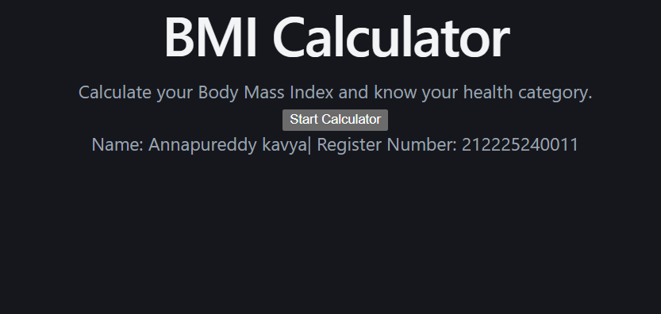
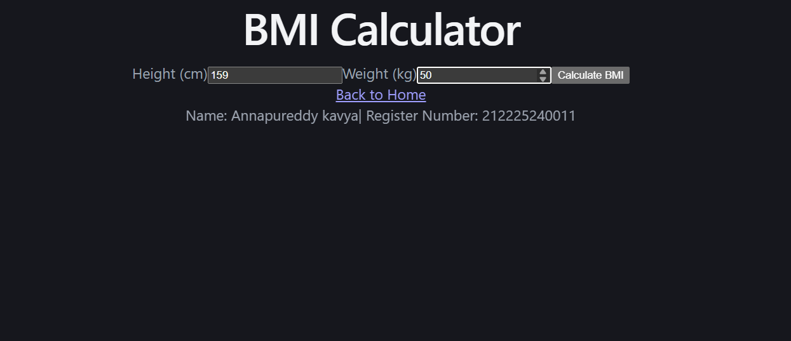
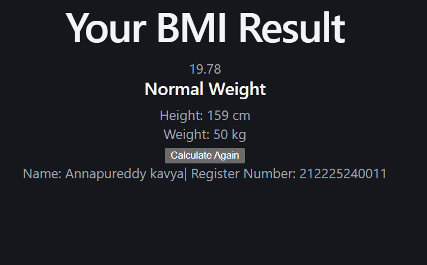

# BMI_calculator
# Ex06 BMI Calculator
## Date:04/09/2026


## AIM
To create a BMI calculator using React Router 

## ALGORITHM
### STEP 1 State Initialization
Manage the current page (Home or Calculator) using React Router.

### STEP 2 User Input
Accept weight and height inputs from the user.

### STEP 3 BMI Calculation
Calculate the BMI based on user input.

### STEP 4 Categorization
Classify the BMI result into categories (Underweight, Normal weight, Overweight, Obesity).

### STEP 5 Navigation
Navigate between pages using React Router.

## PROGRAM
## App.jsx
```
import { BrowserRouter, Routes, Route, Link, useNavigate } from "react-router-dom";
import { useState } from "react";

function Home() {
  return (
    <div className="page">
      <div className="card">
        <h1>BMI Calculator</h1>

        <p>
          Calculate your Body Mass Index and know your health category.
        </p>

        <Link to="/bmi">
          <button>Start Calculator</button>
        </Link>
      </div>
    </div>
  );
}

function BMI() {
  const [height, setHeight] = useState("");
  const [weight, setWeight] = useState("");
  const [error, setError] = useState("");

  const navigate = useNavigate();

  const calculateBMI = (e) => {
    e.preventDefault();

    if (height === "" || weight === "") {
      setError("Please enter both height and weight.");
      return;
    }

    if (Number(height) <= 0 || Number(weight) <= 0) {
      setError("Height and weight must be greater than 0.");
      return;
    }

    setError("");

    navigate(`/result?height=${height}&weight=${weight}`);
  };

  return (
    <div className="page">
      <div className="card">
        <h1>BMI Calculator</h1>

        <form onSubmit={calculateBMI}>
          <label>Height (cm)</label>

          <input
            type="number"
            placeholder="Enter height in cm"
            value={height}
            onChange={(e) => setHeight(e.target.value)}
          />

          <label>Weight (kg)</label>

          <input
            type="number"
            placeholder="Enter weight in kg"
            value={weight}
            onChange={(e) => setWeight(e.target.value)}
          />

          {error && <p className="error">{error}</p>}

          <button type="submit">Calculate BMI</button>
        </form>

        <Link to="/">Back to Home</Link>
      </div>
    </div>
  );
}

function Result() {
  const params = new URLSearchParams(window.location.search);

  const height = Number(params.get("height"));
  const weight = Number(params.get("weight"));

  const heightInMeters = height / 100;
  const bmi = weight / (heightInMeters * heightInMeters);

  let category;

  if (bmi < 18.5) {
    category = "Underweight";
  } else if (bmi < 25) {
    category = "Normal Weight";
  } else if (bmi < 30) {
    category = "Overweight";
  } else {
    category = "Obese";
  }

  return (
    <div className="page">
      <div className="card result-card">
        <h1>Your BMI Result</h1>

        <div className="bmi-value">
          {bmi.toFixed(2)}
        </div>

        <h2>{category}</h2>

        <p>Height: {height} cm</p>
        <p>Weight: {weight} kg</p>

        <Link to="/bmi">
          <button>Calculate Again</button>
        </Link>
      </div>
    </div>
  );
}

function App() {
  return (
    <BrowserRouter>
      <Routes>
        <Route path="/" element={<Home />} />
        <Route path="/bmi" element={<BMI />} />
        <Route path="/result" element={<Result />} />
      </Routes>

      <footer>
        Name: Annapureddy kavya| Register Number: 212225240011
      </footer>
    </BrowserRouter>
  );
}

export default App;
```
## App.css
```
* {
  box-sizing: border-box;
  margin: 0;
  padding: 0;
}

body {
  font-family: Arial, sans-serif;
  background: linear-gradient(135deg, #667eea, #764ba2);
  min-height: 100vh;
}

.page {
  min-height: 100vh;
  display: flex;
  justify-content: center;
  align-items: center;
  padding: 20px;
}

.card {
  width: 100%;
  max-width: 450px;
  background: white;
  padding: 40px;
  border-radius: 20px;
  text-align: center;
  box-shadow: 0 10px 30px rgba(0, 0, 0, 0.2);
}

.card h1 {
  margin-bottom: 15px;
  color: #333;
}

.card p {
  color: #666;
  margin-bottom: 25px;
  line-height: 1.5;
}

form {
  text-align: left;
}

label {
  display: block;
  margin-top: 15px;
  margin-bottom: 8px;
  font-weight: bold;
  color: #333;
}

input {
  width: 100%;
  padding: 13px;
  border: 1px solid #ccc;
  border-radius: 8px;
  font-size: 16px;
}

input:focus {
  outline: none;
  border-color: #667eea;
}

button {
  width: 100%;
  padding: 14px;
  margin-top: 25px;
  border: none;
  border-radius: 8px;
  background: #667eea;
  color: white;
  font-size: 16px;
  font-weight: bold;
  cursor: pointer;
}

button:hover {
  background: #5568d8;
}

a {
  display: inline-block;
  margin-top: 20px;
  color: #667eea;
  text-decoration: none;
  font-weight: bold;
}

.error {
  color: red !important;
  margin-top: 15px;
  margin-bottom: 0 !important;
}

.result-card h2 {
  margin: 20px 0;
  color: #667eea;
}

.bmi-value {
  font-size: 55px;
  font-weight: bold;
  color: #764ba2;
  margin: 20px 0;
}

@media (max-width: 500px) {
  .card {
    padding: 25px;
  }

  .card h1 {
    font-size: 28px;
  }

  .bmi-value {
    font-size: 45px;
  }
}
footer {
  position: fixed;
  bottom: 0;
  left: 0;
  width: 100%;
  padding: 12px;
  text-align: center;
  background: rgba(0, 0, 0, 0.25);
  color: white;
  font-size: 14px;
}
```

## OUTPUT




## RESULT
The program for creating BMI Calculator using React Router is executed successfully.
